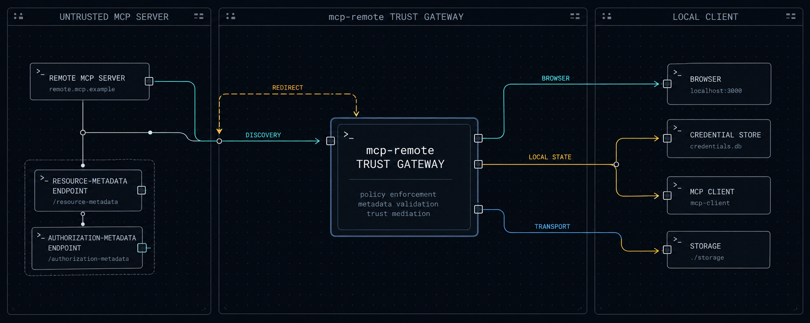
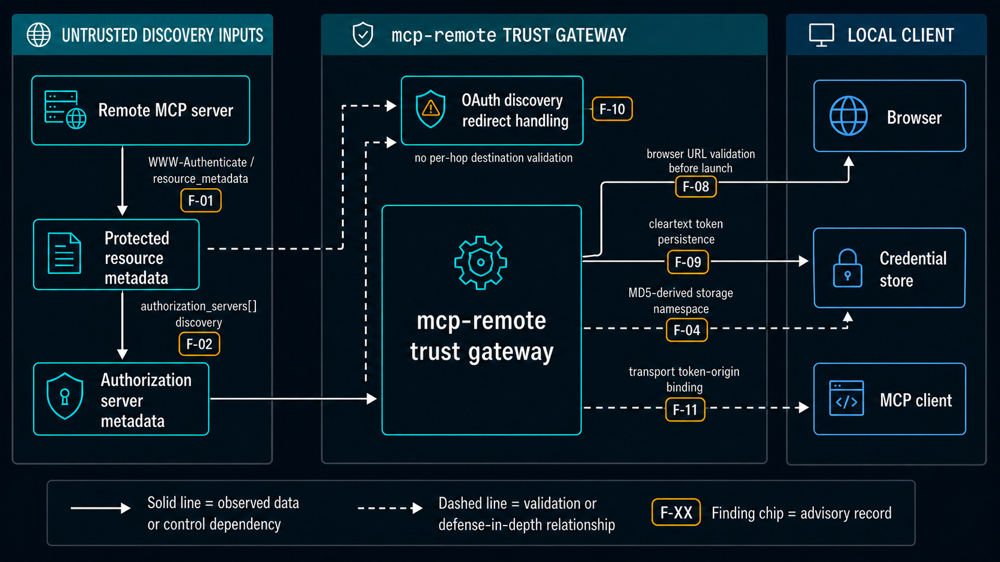

<p align="center">
  
</p>

<h1 align="center">mcp-remote OAuth Trust-Boundary Security Advisories</h1>

<p align="center">
  <strong>Seven evidence-bounded advisory records for
  <code>geelen/mcp-remote</code>. Relevant versions differ by finding and extend
  through the reviewed release, <code>0.1.38</code>.</strong>
</p>

<p align="center">
  <a href="TIMELINE.md"></a>
  <a href="METHODOLOGY.md"></a>
  <a href="https://github.com/geelen/mcp-remote"></a>
  
  <a href="CORRECTIONS.md"></a>
  <a href="https://playb0t.com"></a>
</p>

```text
REMOTE METADATA IS NOT PASSIVE DATA.
Every URL, redirect, origin, and credential handoff is a trust decision.
```

The five CVE records published on 24 September 2026, who has picked them up, and what has and has not been fixed are tracked with dated sources at [playb0t.com](https://playb0t.com).


<!-- research-2026-10-09 -->
## Research update: 9 October 2026

Researcher: Alex Gercog (playb0t)

The [research dossier](docs/research-2026-10-09/RESEARCH_DOSSIER.md) adds three results:

- **Full CLI 0.14.3:** the unchanged published CLI completed three local stdio scenarios
  with 43 HTTP events, including a controlled HTTP 302 redirect. The fixture used
  `http-only`, `client-credentials` and synthetic static client information; mock GET
  requests were challenged and mock POST requests permitted synthetic MCP operations.
  Real OAuth login and desktop UI behavior were not tested.
- **Release history:** selected first-party discovery helpers were traced and executed
  locally across 58 stable releases, 0.1.32 through 0.14.3. The inventory contains
  74 integrity-checked archives; the helper runs recorded 290 local HTTP events.
- **Published code relationships:** selected implementation fragments were found under
  other package names and inside bundles. The [code distribution map](docs/research-2026-10-09/CODE_DISTRIBUTION.md)
  identifies versions, commits, files and matching functions, while separating npm
  records from Git observations. Renaming a package does not necessarily change
  these fragments, so a search for the original name alone gives incomplete coverage.

The selected metadata path is classified as CWE-918 / Missing Defense. These
results do not automatically revise the original CVE ranges, identify a fixed release
or establish downstream deployment.

[Evidence and accounting](docs/research-2026-10-09/EVIDENCE.md) ·
[Recorded procedures and screening sources](docs/research-2026-10-09/REPRODUCIBILITY.md) ·
[Data and checksums](docs/research-2026-10-09/README.md)
<!-- /research-2026-10-09 -->

## Executive summary

`mcp-remote` bridges stdio-only MCP clients to remote MCP servers and performs
OAuth discovery on their behalf. This makes remote-server metadata a security
boundary: the client must not treat server-selected URLs, redirects, or
credential destinations as trusted merely because they appear during OAuth
discovery.

The earlier [CVE-2025-6514](https://nvd.nist.gov/vuln/detail/CVE-2025-6514)
fixed command injection in the browser-launch path in version `0.1.16`.
Our review identified adjacent OAuth discovery, local persistence, browser, and
transport-boundary concerns in the release current at disclosure, `0.1.38`. The relevant code
paths entered the release history at different times; the exact range is stated
in each advisory.

The reviewed trust boundaries are summarized below:

<p align="center">
  <a href="assets/mcp-remote-trust-boundary-map.png">
    
  </a>
</p>

The image is a control and data-dependency map, not a packet-level sequence
diagram. Full finding names, version ranges, and evidence classes remain in the
index below.

Two findings were reverified with localhost-only canaries. Three remain bounded
source-review findings. Two stable IDs now document defense-in-depth or
corrected claims. These evidence classes are intentionally not collapsed.

> [!NOTE]
> `v1.0.1` corrects the blanket version range, removes unsupported provisional
> severity scores, and narrows F-04 and F-11. `v1.0.2` (29 September 2026)
> adds the published CVE records to the advisories and names the author. See
> [CORRECTIONS.md](CORRECTIONS.md).

## Advisory index

The identifiers below are stable research IDs. If a public CVE record is issued
for an eligible mechanism, it is added to the corresponding file. On 24 September
2026 MITRE published CVE records for F-01, F-02, F-04, F-08 and F-11; each of those
advisories names its record in its Classification block, with CISA's score where
one has been assigned.

| Research ID | Advisory | Relevant versions | Evidence |
|---|---|---|---|
| [F-01](advisories/F-01-resource-metadata-ssrf.md) | SSRF via unvalidated `resource_metadata` URL | `0.1.32–0.1.38` | Local PoC, reverified |
| [F-02](advisories/F-02-authorization-server-ssrf.md) | Blind SSRF via `authorization_servers[]` | `0.1.32–0.1.38` | Local PoC, reverified |
| [F-04](advisories/F-04-md5-token-isolation.md) | MD5-based storage namespace hardening | `0.0.14–0.1.38` | Defense-in-depth / corrected |
| [F-08](advisories/F-08-browser-url-validation.md) | Incomplete internal-address validation before browser launch | `0.1.16–0.1.38` | Source review |
| [F-09](advisories/F-09-cleartext-token-storage.md) | OAuth credentials stored in cleartext | `0.0.11–0.1.38` | Source review |
| [F-10](advisories/F-10-redirect-validation-bypass.md) | Redirect following bypasses one-time URL validation | `0.1.32–0.1.38` | Source review |
| [F-11](advisories/F-11-sse-token-origin-scope.md) | Explicit token-origin binding as transport hardening | `0.0.18–0.1.38` | Defense-in-depth / corrected |

The researcher asserts no numeric score of its own. The CVSS 3.1 values on the
CVE lines are CISA-ADP assessments and are reported as published.

> [!IMPORTANT]
> The `F-*` identifiers are stable research IDs. A CVE identifier appears in an
> advisory only once a public CVE record binds it to that advisory; F-09 and F-10
> carry none.

## Registry status (2026-10-07)

- **CVE records.** Five records published by MITRE as the CNA on 2026-09-24:
  CVE-2026-51994 (F-01), CVE-2026-51995 (F-02), CVE-2026-51996 (F-04),
  CVE-2026-51997 (F-08) and CVE-2026-52001 (F-11). Two further identifiers
  reserved for this request remain unpublished.
- **CISA-ADP CVSS 3.1.** CVE-2026-51996 9.8 Critical (added 2026-09-29),
  CVE-2026-51994 9.1 Critical, CVE-2026-51997 8.8 High (user interaction
  required), CVE-2026-51995 7.5 High, CVE-2026-52001 7.5 High (added
  2026-10-06). All five records now carry a CISA score. The values are
  reported as published.
- **NVD.** All five records are in status Deferred; NVD displays CISA's metrics
  as secondary and holds none of its own.
- **GitHub Advisory Database.** The five records appear as unreviewed entries
  without a package mapping, so Dependabot does not alert on them; the only
  reviewed advisory mapped to the npm package `mcp-remote` is CVE-2025-6514
  (2025-07-09).
- **OSV.** OSV derives version ranges from the description text and currently
  lists `0.1.38` as fixed; the commit it names as the fix is the `0.1.38`
  release itself, and the records include `0.1.38`. The records' structured
  `affected` field reads `n/a`; a request to populate it with the ranges from
  the descriptions was sent to the CNA on 30 September 2026.
- **CISA KEV.** None of the five records is listed in the Known Exploited
  Vulnerabilities catalog as of 2026-10-04 (catalog of 1,734 entries); CISA's
  SSVC on all five records reads exploitation: none.

The registry snapshot above is dated 7 October. The 9 October
[research dossier](docs/research-2026-10-09/RESEARCH_DOSSIER.md) adds selected-path
evidence through 0.14.3; it does not reclassify every original finding.

## Upstream state at disclosure (2026-07-31)

- Reviewed release: `0.1.38`
- Reviewed and revalidated commit:
  `02619aff36e79803d7c894e8c8ae7b34b2d11f8c`
- Initial verification: 2026-02-17
- Reverification: 2026-05-03
- Current-main check: 2026-07-31
- Later upstream release: none known as of disclosure
- Known exploitation in the wild: none observed or claimed
- Since disclosure: releases `0.1.39` (2026-08-21) through `0.14.3` (2026-09-21),
  published from `punkpeye/mcp-remote`, where the repository moved after
  disclosure; the CVE records name it `geelen mcp-remote`, and the `geelen` URLs
  redirect. The 9 October follow-up above covers the selected discovery path; the other findings retain their stated evidence limits.

## Responsible-disclosure summary

The initial private advisory was submitted on 2026-02-17. The findings were
revalidated on 2026-05-03 after no maintainer response or new release. Public
disclosure follows an extended coordination period and is intended to give
users concrete mitigation, isolation, and monitoring guidance.

See [TIMELINE.md](TIMELINE.md) for the complete chronology and
[METHODOLOGY.md](METHODOLOGY.md) for scope, validation, and limitations.

## Repository map

```text
.
├── README.md                 Research overview and advisory index
├── METHODOLOGY.md            Scope, evidence classes, and limitations
├── TIMELINE.md               Coordinated-disclosure chronology
├── SECURITY.md               Publication corrections and upstream routing
├── CORRECTIONS.md            Changes made after the v1.0.0 audit
├── CITATION.cff              Stable research citation
├── assets/                   Repository visual identity
└── advisories/               One bounded technical record per finding
```

## Use and citation

Defenders, maintainers, and vulnerability databases may cite the stable
advisory URLs in this repository. Please preserve the finding ID, affected
version range, evidence class, and limitations when summarizing a record.

Machine-readable citation metadata is available in [`CITATION.cff`](CITATION.cff).

The article of 30 September 2026 that walks through the five CVE records and the checks a client has to enforce is mirrored in [docs/article-2026-09-30.md](docs/article-2026-09-30.md).

Its second edition of 8 October 2026, written after all five records received CISA scores, is mirrored in [docs/article-2026-10-08.md](docs/article-2026-10-08.md).

## Researcher

Discovered and reported by Alex Gercog ([playb0t](https://github.com/playb0t)).
