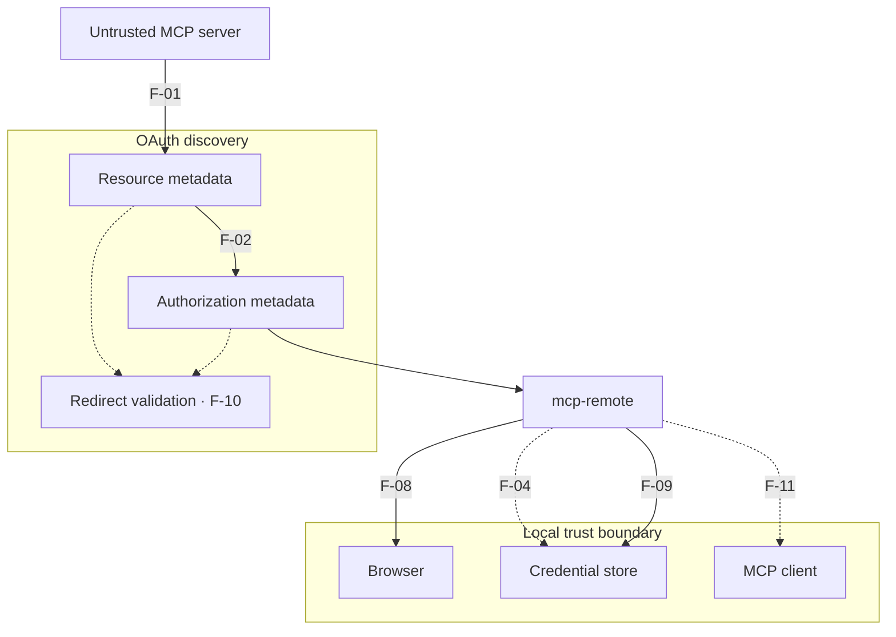

<p align="center">
  
</p>

<h1 align="center">mcp-remote OAuth Trust-Boundary Security Advisories</h1>

<p align="center">
  <strong>Seven evidence-bounded advisory records for
  <code>geelen/mcp-remote</code>. Relevant versions differ by finding and extend
  through the reviewed release, <code>0.1.38</code>.</strong>
</p>

<p align="center">
  <a href="TIMELINE.md"></a>
  <a href="METHODOLOGY.md"></a>
  <a href="https://github.com/geelen/mcp-remote"></a>
  
  <a href="CORRECTIONS.md"></a>
</p>

```text
REMOTE METADATA IS NOT PASSIVE DATA.
Every URL, redirect, origin, and credential handoff is a trust decision.
```

## Executive summary

`mcp-remote` bridges stdio-only MCP clients to remote MCP servers and performs
OAuth discovery on their behalf. This makes remote-server metadata a security
boundary: the client must not treat server-selected URLs, redirects, or
credential destinations as trusted merely because they appear during OAuth
discovery.

The earlier [CVE-2025-6514](https://nvd.nist.gov/vuln/detail/CVE-2025-6514)
fixed command injection in the browser-launch path in version `0.1.16`.
Our review identified adjacent OAuth discovery, local persistence, browser, and
transport-boundary concerns in the current release, `0.1.38`. The relevant code
paths entered the release history at different times; the exact range is stated
in each advisory.

The trust-boundary map is:



The short diagram labels are intentional: full finding names, version ranges,
and evidence classes remain in the index below so the map stays readable in
GitHub's Mermaid renderer and on mobile.

Two findings were reverified with localhost-only canaries. Three remain bounded
source-review findings. Two stable IDs now document defense-in-depth or
corrected claims. These evidence classes are intentionally not collapsed.

> [!NOTE]
> `v1.0.1` corrects the blanket version range, removes unsupported provisional
> severity scores, and narrows F-04 and F-11. See
> [CORRECTIONS.md](CORRECTIONS.md).

## Advisory index

The identifiers below are stable research IDs. If a public CVE record is issued
for an eligible mechanism, it will be added to the corresponding file. F-04 and
F-11 do not claim current CVE eligibility.

| Research ID | Advisory | Relevant versions | Evidence |
|---|---|---|---|
| [F-01](advisories/F-01-resource-metadata-ssrf.md) | SSRF via unvalidated `resource_metadata` URL | `0.1.32–0.1.38` | Local PoC, reverified |
| [F-02](advisories/F-02-authorization-server-ssrf.md) | Blind SSRF via `authorization_servers[]` | `0.1.32–0.1.38` | Local PoC, reverified |
| [F-04](advisories/F-04-md5-token-isolation.md) | MD5-based storage namespace hardening | `0.0.14–0.1.38` | Defense-in-depth / corrected |
| [F-08](advisories/F-08-browser-url-validation.md) | Incomplete internal-address validation before browser launch | `0.1.16–0.1.38` | Source review |
| [F-09](advisories/F-09-cleartext-token-storage.md) | OAuth credentials stored in cleartext | `0.0.11–0.1.38` | Source review |
| [F-10](advisories/F-10-redirect-validation-bypass.md) | Redirect following bypasses one-time URL validation | `0.1.32–0.1.38` | Source review |
| [F-11](advisories/F-11-sse-token-origin-scope.md) | Explicit token-origin binding as transport hardening | `0.0.18–0.1.38` | Defense-in-depth / corrected |

No numeric CVSS score is asserted in this corrective release. A CNA may assign
or merge records differently after reviewing the demonstrated mechanisms and
their impact.

> [!IMPORTANT]
> The `F-*` identifiers are stable research IDs. No new CVE identifier is
> claimed until a public CVE record binds it to the corresponding advisory.

## Current upstream state

- Reviewed release: `0.1.38`
- Reviewed and revalidated commit:
  `02619aff36e79803d7c894e8c8ae7b34b2d11f8c`
- Initial verification: 2026-02-17
- Reverification: 2026-05-03
- Current-main check: 2026-07-31
- Later upstream release: none known as of disclosure
- Known exploitation in the wild: none observed or claimed

## Responsible-disclosure summary

The initial private advisory was submitted on 2026-02-17. The findings were
revalidated on 2026-05-03 after no maintainer response or new release. Public
disclosure follows an extended coordination period and is intended to give
users concrete mitigation, isolation, and monitoring guidance.

See [TIMELINE.md](TIMELINE.md) for the complete chronology and
[METHODOLOGY.md](METHODOLOGY.md) for scope, validation, and limitations.

## Repository map

```text
.
├── README.md                 Research overview and advisory index
├── METHODOLOGY.md            Scope, evidence classes, and limitations
├── TIMELINE.md               Coordinated-disclosure chronology
├── SECURITY.md               Publication corrections and upstream routing
├── CORRECTIONS.md            Changes made after the v1.0.0 audit
├── CITATION.cff              Stable research citation
├── assets/                   Repository visual identity
└── advisories/               One bounded technical record per finding
```

## Use and citation

Defenders, maintainers, and vulnerability databases may cite the stable
advisory URLs in this repository. Please preserve the finding ID, affected
version range, evidence class, and limitations when summarizing a record.

Machine-readable citation metadata is available in [`CITATION.cff`](CITATION.cff).

## Researcher

Discovered and reported by [playb0t](https://github.com/playb0t).
