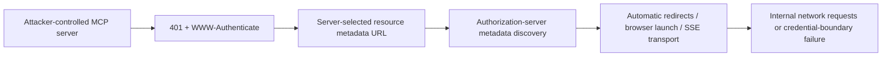

<p align="center">
  
</p>

<h1 align="center">mcp-remote OAuth Trust-Boundary Vulnerabilities</h1>

<p align="center">
  <strong>Coordinated security disclosure for <code>geelen/mcp-remote</code>
  versions <code>0.1.16</code> through <code>0.1.38</code>.</strong>
</p>

<p align="center">
  <a href="TIMELINE.md"></a>
  <a href="METHODOLOGY.md"></a>
  <a href="https://github.com/geelen/mcp-remote"></a>
  
  
</p>

```text
REMOTE METADATA IS NOT PASSIVE DATA.
Every URL, redirect, origin, and credential handoff is a trust decision.
```

## Executive summary

`mcp-remote` bridges stdio-only MCP clients to remote MCP servers and performs
OAuth discovery on their behalf. This makes remote-server metadata a security
boundary: the client must not treat server-selected URLs, redirects, or
credential destinations as trusted merely because they appear during OAuth
discovery.

The earlier [CVE-2025-6514](https://nvd.nist.gov/vuln/detail/CVE-2025-6514)
fixed command injection in the browser-launch path in version `0.1.16`.
Our review found that adjacent OAuth discovery and credential-handling paths
remained exposed in versions `0.1.16` through the current release, `0.1.38`.

The headline chain is:



Two findings were reverified with localhost-only canaries. Four are bounded
source-review findings. One is explicitly conditional defense-in-depth. These
evidence classes are intentionally not collapsed.

## Advisory index

The identifiers below are stable research IDs. CVE identifiers will be added to
the corresponding files when the public CVE records are available.

| Research ID | Finding | Suggested CVSS 3.1 | Evidence |
|---|---|---:|---|
| [F-01](advisories/F-01-resource-metadata-ssrf.md) | SSRF via unvalidated `resource_metadata` URL | 6.5 | Local PoC, reverified |
| [F-02](advisories/F-02-authorization-server-ssrf.md) | Blind SSRF via `authorization_servers[]` | 4.3 | Local PoC, reverified |
| [F-04](advisories/F-04-md5-token-isolation.md) | MD5-based OAuth token-file isolation | 5.9 | Source review |
| [F-08](advisories/F-08-browser-url-validation.md) | Incomplete internal-address validation before browser launch | 5.4 | Source review |
| [F-09](advisories/F-09-cleartext-token-storage.md) | OAuth credentials stored in cleartext | 5.5 | Source review |
| [F-10](advisories/F-10-redirect-validation-bypass.md) | Redirect following bypasses one-time URL validation | 7.5 | Source review |
| [F-11](advisories/F-11-sse-token-origin-scope.md) | SSE authorization injection lacks explicit origin binding | 5.3 | Conditional defense-in-depth finding |

These scores were proposed by the researcher. They are not CNA or NVD scores.

> [!IMPORTANT]
> The `F-*` identifiers are stable research IDs. No new CVE identifier is
> claimed until a public CVE record binds it to the corresponding advisory.

## Current upstream state

- Reviewed release: `0.1.38`
- Reviewed and revalidated commit:
  `02619aff36e79803d7c894e8c8ae7b34b2d11f8c`
- Initial verification: 2026-02-17
- Reverification: 2026-05-03
- Current-main check: 2026-07-31
- Fixed release: none known as of disclosure
- Known exploitation in the wild: none observed or claimed

## Responsible-disclosure summary

The initial private advisory was submitted on 2026-02-17. The findings were
revalidated on 2026-05-03 after no maintainer response or new release. Public
disclosure follows an extended coordination period and is intended to give
users concrete upgrade, isolation, and monitoring guidance.

See [TIMELINE.md](TIMELINE.md) for the complete chronology and
[METHODOLOGY.md](METHODOLOGY.md) for scope, validation, and limitations.

## Repository map

```text
.
├── README.md                 Research overview and advisory index
├── METHODOLOGY.md            Scope, evidence classes, and limitations
├── TIMELINE.md               Coordinated-disclosure chronology
├── SECURITY.md               Publication corrections and upstream routing
├── CITATION.cff              Stable research citation
├── assets/                   Repository visual identity
└── advisories/               One bounded technical record per finding
```

## Use and citation

Defenders, maintainers, and vulnerability databases may cite the stable
advisory URLs in this repository. Please preserve the finding ID, affected
version range, evidence class, and limitations when summarizing a record.

Machine-readable citation metadata is available in [`CITATION.cff`](CITATION.cff).

## Researcher

Discovered and reported by [playb0t](https://github.com/playb0t).
